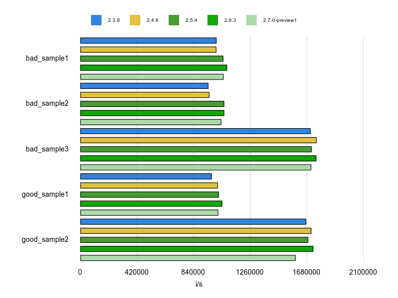
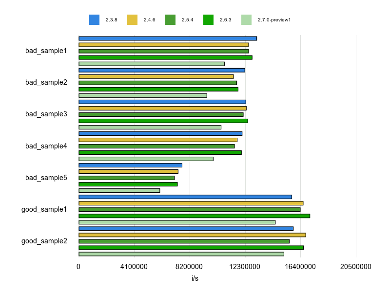
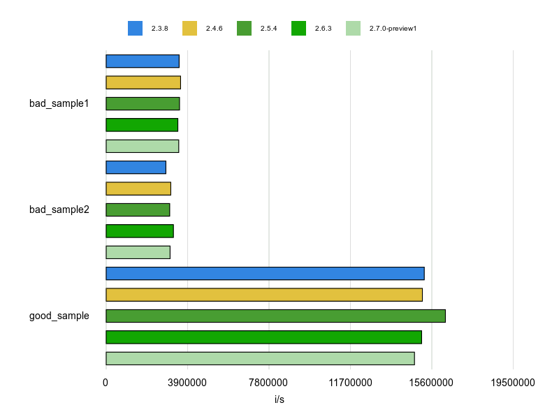
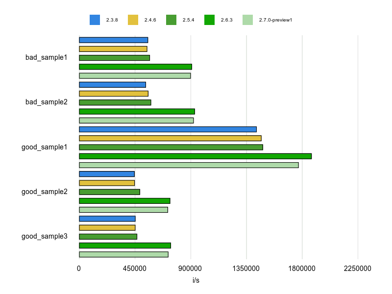
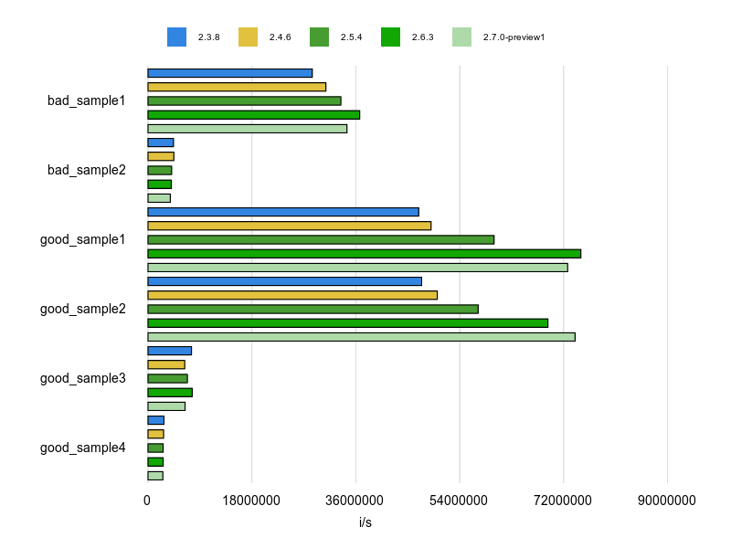

# Results

## Performance/Caller
- [code](benchmarks/caller.rb)

## Performance/CaseWhenSplat
- [code](benchmarks/case-when-splat.rb)

## Performance/Casecmp
- [code](benchmarks/casecmp.rb)

## Performance/ChainArrayAllocation
- [code](benchmarks/chain-array-allocation.rb)

## Performance/CompareWithBlock
- [code](benchmarks/compare-with-block.rb)

## Performance/Count
- [code](benchmarks/count.rb)

## Performance/Detect
- [code](benchmarks/detect.rb)

## Performance/DoubleStartEndWith
- [code](benchmarks/double-start-end-with.rb)

## Performance/EndWith
- [code](benchmarks/end-with.rb)

## Performance/FixedSize

- No Result

## Performance/FlatMap
- [code](benchmarks/flat-map.rb)

## Performance/InefficientHashSearch
- [code](benchmarks/inefficient-hash-search-key.rb)

- [code](benchmarks/inefficient-hash-search-value.rb)

## Performance/OpenStruct
- [code](benchmarks/openstruct.rb)

## Performance/RangeInclude
- [code](benchmarks/range-include.rb)

## Performance/RedundantBlockCall
- [code](benchmarks/redundant-block-call.rb)

## Performance/RedundantMatch
- No Result
- 
## Performance/RedundantMerge
- [code](benchmarks/redundant-merge.rb)

## Performance/RegexpMatch
- [code](benchmarks/regexp-match.rb)

## Performance/ReverseEach
- [code](benchmarks/reverse_each.rb)

## Performance/Size
- [code](benchmarks/size.rb)

## Performance/StartWith
- [code](benchmarks/start_with.rb)

## Performance/StringReplacement
- [code](benchmarks/string-replacement.rb)

## Performance/TimesMap
- [code](benchmarks/times-map.rb)

## Performance/UnfreezeString
- [code](benchmarks/unfreeze-string.rb)

## Performance/UriDefaultParser
- [code](benchmarks/uri-default-parser.rb)

## Appendix
- [code](benchmarks/appendix/literal.rb)

